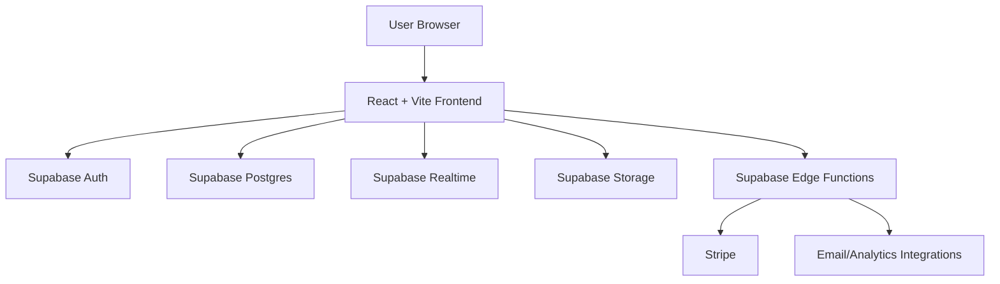

# Leaked Liability

Leaked Liability is a production-industry accountability platform for tracking unpaid or late payments, improving transparency, and helping crews, vendors, and producers resolve payment disputes faster.

## Problem -> Solution

### Problem
Freelancers and vendors in production often have fragmented, private, and inconsistent visibility into payment behavior across producers and companies.

### Solution
Leaked Liability provides a structured, user-driven system for:

- Reporting payment timelines and outcomes
- Surfacing accountability data in a public leaderboard
- Enabling secure escrow-assisted resolution flows
- Giving admins tooling to moderate, verify, and manage risk

## Tech stack

- **Frontend:** React 18, TypeScript, Vite, React Router
- **UI:** Tailwind CSS, shadcn/ui, Radix UI
- **Data/auth:** Supabase (Postgres, Auth, Realtime, Storage)
- **Payments:** Stripe
- **Testing:** Vitest
- **Tooling:** ESLint, tsx scripts

## Key features

- Public leaderboard and transparency views
- Report submission and confirmation flows
- Liability claim and liability arena workflows
- Escrow initiation, payment, and redemption
- Producer dashboard and profile/account flows
- Admin dashboards (report editing, producer merge, analytics, network graph)
- Call sheet manager and reservoir workflows (beta-gated)
- Security and reliability validation helpers for env, storage, and RLS assumptions

## Architecture (high level)



### Repository layout

```text
src/
  components/     Reusable UI and feature components
  pages/          Route-level pages and flows
  lib/            App utilities and domain helpers
  config/         Runtime/env configuration and validation
  integrations/   External clients (including Supabase client wiring)
supabase/
  migrations/     Database migrations
  functions/      Edge Functions for backend workflows
tests/
  integration/    Integration tests (checkout and escrow paths)
docs/             Security and launch diagnostics
```

## Quickstart

### 1) Install dependencies

```bash
npm install
```

### 2) Configure environment variables

Create a `.env.local` file:

```bash
VITE_SUPABASE_URL=...
VITE_SUPABASE_PUBLISHABLE_KEY=...
VITE_STRIPE_PUBLISHABLE_KEY=... # required for payment flows
```

### 3) Run development server

```bash
npm run dev
```

### 4) Run quality checks

```bash
npm run lint
npm run test:integration
```

### 5) Build for production

```bash
npm run build
```

## What I built

- Designed and implemented the frontend architecture for multi-flow user journeys (public reporting, claims, escrow, admin)
- Built resilient client-side guards around environment configuration, Supabase connectivity, and role-based access
- Integrated payment workflows with Stripe-backed escrow paths
- Implemented operational tooling for call sheet workflows, analytics surfaces, and admin moderation actions
- Shipped the product with security-focused checklists and diagnostics documentation

## Screenshots

Add screenshots in `docs/screenshots/` and reference them here:

- `docs/screenshots/leaderboard.png`
- `docs/screenshots/submit-report.png`
- `docs/screenshots/admin-dashboard.png`

## Notes

- This platform hosts user-submitted production payment data and includes legal/privacy/disclaimer pages in-app.
- For operational and security context, see:
  - `docs/SECURITY_SCORECARD_AND_LAUNCH_CHECKLIST.md`
  - `SECURITY_FIXES_COMPLETED.md`
  - `PRODUCTION_DIAGNOSTICS_REPORT.md`
